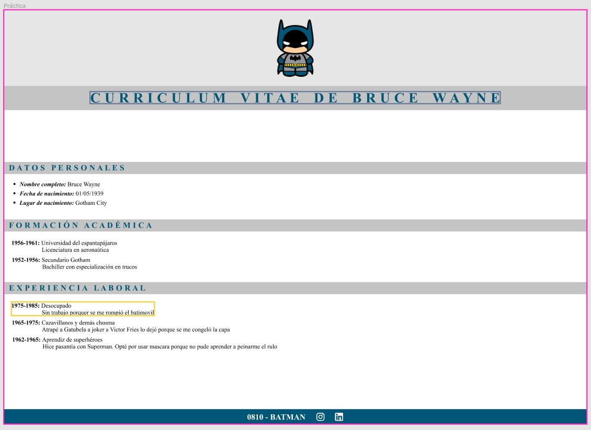

# Práctica Integradora

1. reconocer cuáles podrían ser los diferentes elementos o etiquetas que corresponden a ese resultado visual;
2. crear la estructura de carpetas necesaria;
3. trasladar la idea a una maqueta utilizando etiquetas HTML;
4. aplicar estilos CSS para mejorar la estética del trabajo;
5. subir el trabajo terminado a GitHub;
6. compartir el enlace en el canal FE1 de Discord.

